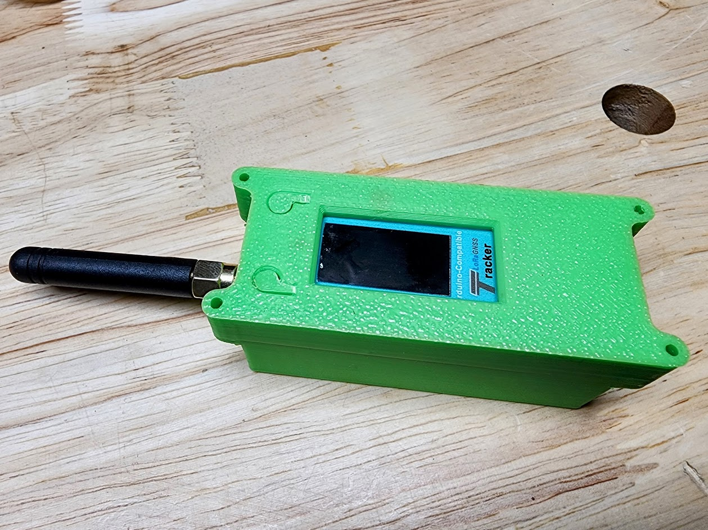

# Wireless Tracker (Heltec and MakerFocus)

**Please note that this github is for Version 1.1 of the Heltec/Makerfocus Wireless Tracker. All new boards sold are version 1.1.**

The Wireless Tracker is a cutting-edge development kit that combines the power of ESP32-S3FN8, SX1262, and UC6580 chips. This trifecta of hardware enables the device to provide versatile IoT applications, from GNSS solutions to LoRa communications plus an onboard OLED display. Whether you're tracking assets, monitoring livestock, locating vehicles, or safeguarding children, the Wireless Tracker is the perfect fit.

US Purchase: [Amazon.com](https://www.amazon.com/MakerFocus-Integrate-Bluetooth-Development-Intelligent/dp/B0CG1GG1LQ/ref=sr_1_1?crid=1SBXCY6AJ0AAO&keywords=makerfocus+tracker&qid=1696472127&sprefix=makerfocus+tracker%2Caps%2C148&sr=8-1) <$30.00USD

## Features

### Advanced Chips

  
<b>ESP32-S3FN8</b>

  - **Connectivity**: The [ESP32-S3FN8](https://www.espressif.com/sites/default/files/documentation/esp32-s3_datasheet_en.pdf) supports both Wi-Fi and Bluetooth connectivity, allowing for versatile wireless communication.
  
  - **GPIO Pins**: There are 11 GPIO pins available for various functions-the rest of the ESP32 pins are used for various connections to other chips:
    - `4 (GPIO, ADC1_CH3)`
    - `5 (GPIO, ADC1_CH4)`
    - `6 (GPIO, ADC1_CH5)`
    - `7 (GPIO, ADC1_CH6)`
    - `15 (GPIO, ADC2_CH4, U0RTS, XTAL_32K P)`
    - `16 (GPIO, ADC2_CH5, U0CTS, XTAL_32K N)`
    - `17 (GPIO, ADC2_CH6, U1TXD)`
    - `26 (GPIO, SPICS1)`
    - `37 (GPIO, SPIDQS, FSPIQ, SUBSPIQ)`
    - `45 (GPIO)`
    - `46 (GPIO)`
    - `47 (GPIO) and 48 (GPIO) do not seem to influence the GPS in any way, even though they are connected to Boot_Mode (could put GPS into firmware upgrade mode) and D_SEL (which could remap internal GPS pinout). They appear to be free of use to the user.`

 **--Note--**  The pinouts below are for version 1.0, Heltec has not provided a version 1.1 for us to reference. You can view the full V1.1 Schematic here: [Heltec Wireless Tracker Schematic](https://resource.heltec.cn/download/Wireless_Tracker/Wireless_Tacker1.1) FYI- 0.5 = V1.1 and 0.3 = V1.0

  
<b>ESP32-S3FN8 Pinout</b>
 

  
<b>SX1262</b>

  - **LoRa Communication**: The [SX1262 module](https://www.semtech.com/products/wireless-rf/lora-connect/sx1262#_application_notes) facilitates long-range (LoRa) communication. LoRa is a spread spectrum modulation technique derived from chirp spread spectrum (CSS) technology, allowing for long-range communication with low power consumption.

  
<b>UC6580</b>

  - **GNSS Solutions**: The [UC6580 module](https://en.unicorecomm.com/products/detail/34) provides fast Global Navigation Satellite System (GNSS) solutions. This allows for high-precision tracking, making it suitable for applications where precise location tracking is crucial.

### Advanced GNSS Capabilities

- Dual-frequency multi-system based on 22nm technology.
- Supports L1 + L5/L2 positioning.
- Compatible with multiple satellite systems: GPS, GLONASS, BDS, Galileo, NAVIC, and QZSS.

### Design and Interfaces

- **Type-C USB Interface**: Equipped with voltage regulation, ESD protection, short circuit protection, RF shielding, and more.
- **Battery Management**: Onboard SH1.25-2 battery interface with integrated lithium battery management system, including charge/discharge management, overcharge protection, battery power detection, and automatic switching between USB and battery power.
- **Connectivity**: Dedicated 2.4GHz metal spring antenna for Wi-Fi and Bluetooth. Reserved IPEX (U.FL) interface for LoRa and GNSS.
- **Display**: 0.96-inch 160x80 dot matrix OLED for showcasing debugging information, battery status, and more.

### Power Metrics

**Power Consumption**:
- UC6580 uses 45 mA through Vext
- Tracker uses 35 mA @ 80 MHz (Vext disabled)
- Tracker uses 18.5 uA during deepsleep, if done properly

### Developer-Friendly

- Seamless compatibility with the Arduino development environment, simplifying innovation and prototyping.

## Applications

- **Bicycle Sharing**: Track bicycles in real-time.
- **Pet and Livestock Tracking**: Ensure their safety and monitor movements.
- **Vehicle Location**: Manage fleet vehicles or locate personal cars.
- **Child Safety**: Actively track and ensure children's safety.

## Getting Started

- [Heltec Wireless Tracker Manual(In Markdown)](/manual/heltecwirelesstrackermanual.markdown)
- [Arduino library for Heltec ESP32 (or ESP32+LoRa) based boards](https://github.com/HelTecAutomation/Heltec_ESP32)
- [Heltec Additional Information](https://docs.heltec.cn/en/node/esp32/wireless_tracker/index.html)
- [Examples](https://github.com/Heltec-Aaron-Lee/WiFi_Kit_series/tree/b9a9180f8ec5ff69b69bdaa31684583c4a5a5813/libraries/HeltecExample/examples)
- [JSON Version 1.0.0 To Install Heltec Wireless Tracker in Arduino IDE](https://github.com/Heltec-Aaron-Lee/WiFi_Kit_series/releases)

  
  
- [3D printable case here!](/3D%20Printed%20Case/README.md)

### Prerequisites

- Arduino IDE

### Setup Instructions

1. Connect the device using the Type-C USB interface.

## License

[View License Terms Here](/LICENSE)

<!-- CONTRIBUTING -->
## Contributing

Contributions are what make the open source community such an amazing place to learn, inspire, and create. Any contributions you make are **greatly appreciated**.

If you have a suggestion that would make this better, please fork the repo and create a pull request. You can also simply open an issue with the tag "enhancement".
Don't forget to give the project a star! Thanks again!

1. Fork the Project
2. Create your Feature Branch (`git checkout -b feature/AmazingFeature`)
3. Commit your Changes (`git commit -m 'Add some AmazingFeature'`)
4. Push to the Branch (`git push origin feature/AmazingFeature`)
5. Open a Pull Request

(<a href="#readme-top">back to top</a>)

<!-- CONTACT -->
## Contact

Your Name - Jeff Higgason - jeffh@opensar.net

Project Link: [https://github.com/jhiggason/lorawirelesstracker](https://github.com/jhiggason/lorawirelesstracker)

(<a href="#readme-top">back to top</a>)

